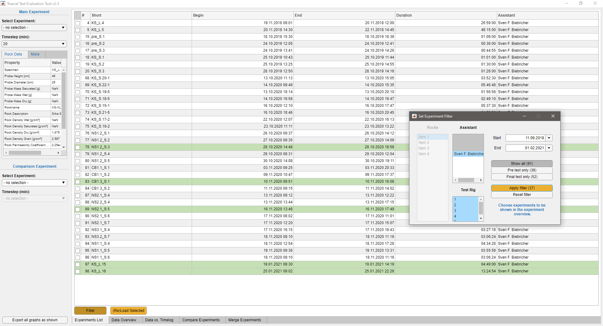

# Triaxial Test Evaluation Tool

> With this evaluation tool you can check and interpret the results of a modified <a href="https://en.wikipedia.org/wiki/Triaxial_shear_test" target="_blank">`geotechnical triaxial test`</a>.
With this appliance it is possible to confine a probe, rise the axial stress and measure the permeability of the probe at all stages.
The tool was developed as part of a joint project called MERID (Microstructural Influence on Reservoir Integrity at Variable Hydromechanical Conditions) funded by the German Federal Ministry of Education and Research as part of GEO:N Project ([Geoforschung für Nachhaltigkeit](https://www.bmbf.de/de/geoforschung-2398.html)) to evaluate the results of a special assembled large triaxial cell.
This tool consists of a backend and a frontend both assembled in MathWorks Matlab.
The backend creates a connection to a MySQL-Database where the results of all experiments stored.

[](LICENSE.md) 
[](https://github.com/froido/triaxial_test_evaluation_tool/releases) 
[](https://github.com/froido/triaxial_test_evaluation_tool/releases) 
[](https://zenodo.org/badge/latestdoi/206527480) 


[](https://mathworks.com/)
[](https://www.oracle.com/de/mysql/)

---


## Features

### Frontend (GUI)

 - List and overview of all experiments in database
 - Keep rock/soil parameters always in view
 - Check experiment descriptions and additional comments
 - Get an overview of important parameters and their connection
 - Show experiment's time log related to experiments data
 - Change integration time step for permeability calculation
 - Plot graphs with variable x-axis and two possible y-axes
 - Compare to different/independent experiments
 - Export graphs easily as raster graphics (1200 DPI) or vector graphics

<p align="center">
   
</p><p align="center">
   
</p>
 

### Backend

 - Class oriented programming in Matlab
 - Connection to MySQL database
 - Interface between frontend (GUI) and MySQL database
 - Separate classes for handling experiments metadata `ExperimentsMetaData`, measured values `ExperimentsData`, rock/soil related data `ExperimentsSpecimenData`, MySQL database connection `MeridDB`, interface to frontend (GUI) `TriaxTestHandler`
 - Measured data cleansing like filtering NaN values
 - Calculating permeability and permeability coefficient according to fluid (water) properties with help of <a href="https://github.com/isantosruiz" target="_blank">isantosruiz'</a> <a href="https://github.com/isantosruiz/water-properties" target="_blank">`water-properties`</a> repository.


---

## Requirements

 - Matlab Version 2020a or newer
 - [Matlab Curve Fitting Toolbox](https://de.mathworks.com/products/curvefitting.html) for permeability calculations
 - [JDBC MySQL Connector](https://dev.mysql.com/downloads/connector/j/) included in Matlab `javaclasspath` (dynamic or static)
 - Configured MySQL database engine (a script creating the database skeleton is [attached](sample/database_generation_script.sql) in this repository) which includes all triaxial test data sets
 
 ---
 
## Setup

 - Have a running MathWorks Matlab 2019b or higher engine with installed curve fitting toolbox.
 - Have a running MySQL engine with a database according to the needs of this tool. To create a valid database you can use the [batch file](sample/database_generation_script.sql) in this repository.
 - Download [JDBC MySQL Connector](https://dev.mysql.com/downloads/connector/j/) (platform independent version) to your local machine.
 - Add JDBC MySQL Connector to `javaclasspath` dynamic part
  ```matlab
  >> javaaddpath('/your_folder/mysql-connector-java-8.0.20.jar')
  ```
 - Check if adding was successful
  ```matlab
  >> javaclasspath
    
    /some_other_folder/some_file.jar
    
        DYNAMIC JAVA PATH

    /your_folder/mysql-connector-java-8.0.20.jar
  ```
 - Download the latest release of Triaxial Test Evaluation Tool to your local machine and include the submodule `water-properties` additionally. As an alternative you can clone the repository via
 `git clone --recurse-submodules --remote-submodules https://github.com/froido/triaxial_test_evaluation_tool.git`
 - Run `GUI.mlapp`
 

---

## Usage

1. Adding triaxial test data sets to the database
2. Start the `Triaxial Test Evaluation Tool` via `GUI.mlapp`.
3. Select a main experiment from the shown list.
4. Evaluate your test results and enjoy.

---

## Additional Hints

 - Matlab has often problems with the timezone set in Oracle MySQL database under Windows systems. CEST (German: MESZ) is unknown for Matlab, which leads to an error. Set the timezone manually to e.g. `+02:00`.
 ```mysql
 SET GLOBAL time_zone = '+02:00';
 ```
 - Due to very big data sets the global buffer size shall be extended in MySQL database to e.g. 4 gigabyte
 ```mysql
 SET GLOBAL innodb_buffer_pool_size=4294967296;
 ```
 - After a couple of changes were performed in the graphs, the GUI of Matlab lags sometimes for unknown reasons. You have two options: kill or wait.

---

## Support

Reach out to me at one of the following places!

- Website at <a href="https://www.gut.rwth-aachen.de/cms/Geotechnik/Das-Institut/Team/~liwvr/Sven-Biebricher/?lidx=1" target="_blank">`www.gut.rwth-aachen.de`</a>
- <a href="https://orcid.org/0000-0001-9018-3485" target="_blank">ORCID</a>
- <a href="https://www.xing.com/profile/SvenF_Biebricher" target="_blank">XING</a>

---

## License

[](LICENSE.md)
This project is licensed under the GNU General Public License v3.0 - see [LICENSE.md](LICENSE.md) file for details

---

## Thanks

[](https://github.com/isantosruiz/water-properties)
[](https://github.com/DrosteEffect/BrewerMap)
